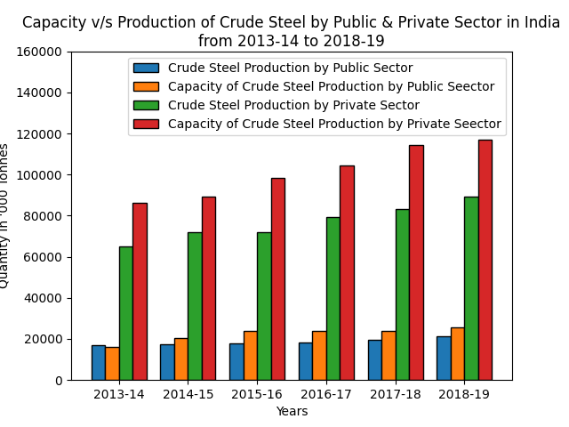
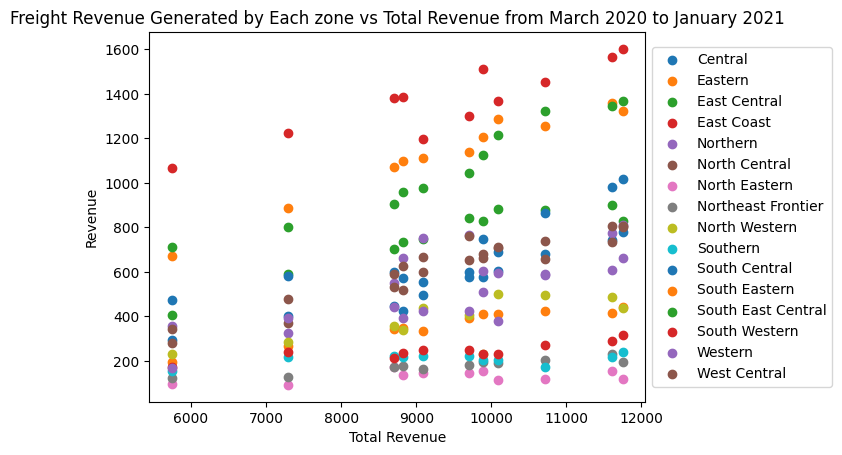
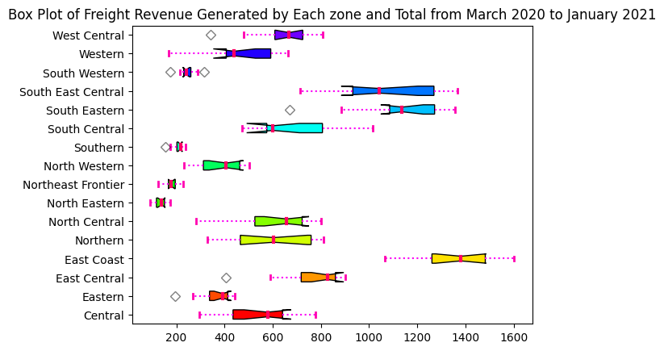

# DS200_Project
This repository contains scripts and results for DS200 : Research Methods project. 

## Bar Plot
Data link : https://data.gov.in/resource/capacity-utilization-crude-steel-production-public-and-private-sector-india-2013-14-2018  

**Observations** 
- Private sector produces more crude steel than government sector
- Private sector underperforms than it's capacity whereas government sector has always performed similar to it's capacity.

## Scatter Plot
Data Link : https://data.gov.in/resource/month-wise-and-zone-wise-freight-revenue-generated-march-2020-january-2021-ministry
 
**Observations** 
- East Coast has the highest revenue for all the years. 
- North Eastern has the lowest revenue for all the years.

## Box Plot
Data Link : https://data.gov.in/resource/month-wise-and-zone-wise-freight-revenue-generated-march-2020-january-2021-ministry
 
**Observations** 
- West Central has normal distribution as median is in middle of the distribution. 
- Similarly, distributions such as East Central, Eastern has negative skewness as median is closer to the top of the box. 
- Similarly, distributions such as South Central, Western has positive skewness as median is closer to the bottom of the box.

## Requirements
Python 3.10.7  
- matplotlib==3.6.0
- numpy==1.23.3
- pandas==1.4.4  

## Resources 
- Capacity_Utilisation_in_Crude_Steel_Production_0.csv : This file containes data related to crude steel production. (https://data.gov.in/resource/capacity-utilization-crude-steel-production-public-and-private-sector-india-2013-14-2018  )
- RS_Session_253_AU1417.B.csv : This file contains data related to Freight revenue. (https://data.gov.in/resource/month-wise-and-zone-wise-freight-revenue-generated-march-2020-january-2021-ministry)

## Scripts Usage
- bar_plot.py  
  `python visualize_bar_plot.py`
- scatter_plot.py  
  `python visualize_scatter_plot.py`
- box_plot.py  
  `python visualize_box_plot.py`